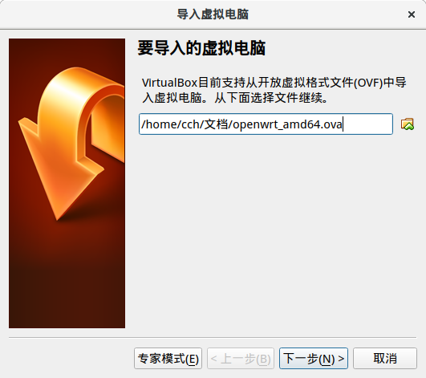
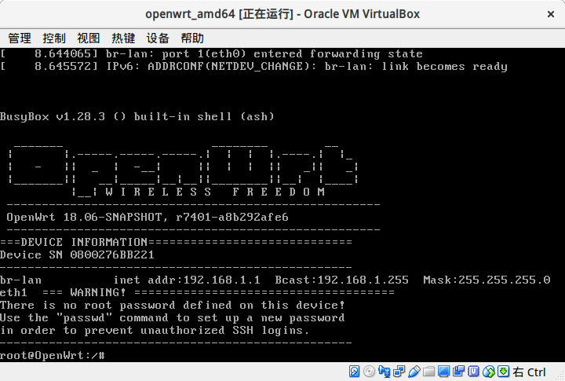

---

# 虚拟机开发环境

FreeIOE提供基于[虚拟机](http://vbox.freeioe.org)的虚拟网关开发环境，可用以应用开发、测试等。

此虚拟网关包含X86_64(glibc)的OpenWRT系统 （18.06），以及初始安装的FreeIOE。等工作。

## 下载虚拟机镜像

* 下载[地址](https://thingscloud.oss-cn-beijing.aliyuncs.com/download/freeioe.zip)
* 安装虚拟机软件，建议使用
    * [VirtualBox](http://virtualbox.org)
    * [VMWare Workstation](https://www.vmware.com)
* 导入下载好的虚拟机镜像
* 开启虚拟机
* 等待虚拟机启动完毕

### 导入虚拟机

### 运行虚拟机

虚拟机运行成功后，在界面激活用户console时，能看到设备的IP信息。

* br-lan   内部网络 （虚拟机设置中的网卡1)
* eth1   虚拟用以上网的网络 （虚拟机设置中的网卡2)

使用浏览器访问eth1的IP的8808端口，即可看到FreeIOE的管理页面。

> 备注： 在某些虚拟机软件版本下，虚拟机的网卡列表是相反的，当出现下图eth1无法获取IP，或者获取的IP为192.168.56.X时，请尝试将虚拟机网卡1和网卡2的设置交换一下。

## 添加虚拟设备

* 登录[云平台](http://cloud.thingsroot.com)
* [申请虚拟设备序列号](http://cloud.thingsroot.com/virtualgateways)
* 点击"申请虚拟网关"后，复制出现的虚拟网关序列号

## 连接云平台

需要更改虚拟设备的序列号，虚拟设备才能正常连接云平台，修改步骤如下：

* 使用浏览器访问虚拟机的eth1 IP的8808端口: http:://eth1_ip:8808/cloud
* 在“云ID(Cloud ID)” 的位置输入从平台申请的虚拟设备序列号，并点击“修改(Change)”
* 点击页面下方的“重启(Reboot)”确保序列号生效

## 开发应用

可以从下列方式中选择你喜欢的方式:

* [使用VSCode插件开发](vscode-extension.md)
* [应用中心在线开发](app_center.md)
* [设备Web在线开发](dev_web.md)

