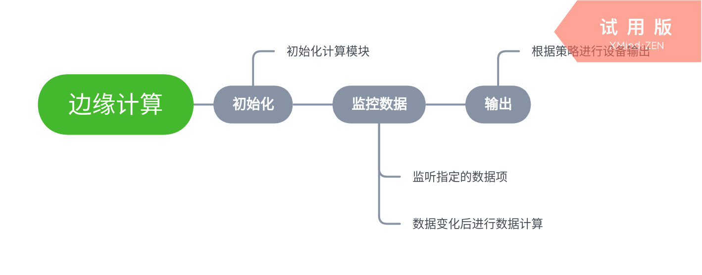

---

# 边缘计算

此章将介绍如何开发一个边缘计算应用。此应用将根据其他应用采集到的设备数据，根据数据的当前值，来触发一个自动化控制策略。

## 要实现什么？

我们假设的场景是：

1. 当温度传感器数据超过40度时，打开一个 DO 输出项（驱动风扇开关）
2. 当温度传感器数据降低到30度时，关闭 DO 输出



## 构造边缘计算应用

FreeIOE 提供的应用基础类模块，提供了进行边缘计算的接口和功能。本章将基于此模块来构建应用。 [手册](../../../reference/app/base/init.md)

```lua
local app_base = require 'app.base'

local app = app_base:subclass('EXAMPLE_CALC_APP_IN_GUIDE')
app.static.API_VER = 5
```

## 初始化计算模块

跟采集应用相比，我们在应用初始化时需要初始化计算模块：

``` lua
function app:on_init()
	-- 计算帮助模块初始化
	local calc = self:create_calc()
end
```

## 数据计算

计算模块提供了监听方式的计算回调:

1. 当所有所需数据就绪时，进行逻辑回调
2. 当任一数据发生变化时，进行逻辑回调

``` lua
function app:on_start()
	local source_device_sn = 'xxxxxxxxxxxxx.xxx'
	self._calc:add('unique_name_for_calc', {
		{ sn = source_device_sn, input = 'temperature', prop='value'}
	}, function(temperature)
		if temperature > 40 then
			---  turn the fan on
			self:control_fan(true)
			self._fan_on = true
			return
		end
		if self._fan_on and temperature < 30 then
			--- turn the fan off
			self:control_fan(false)
			self._fan_on = false
			return
		end
	end)
end
```

## 示例代码

```lua
local app_base = require 'app.base'

local app = app_base:subclass('EXAMPLE_CALC_APP_IN_GUIDE')
app.static.API_VER = 5

function app:on_init()
	-- 计算帮助模块初始化
	local calc = self:create_calc()
	self._fan_on = false
end

function app:on_start()
	local source_device_sn = 'xxxxxxxxxxxxx.xxx'
	self._calc:add('unique_name_for_calc', {
		{ sn = source_device_sn, input = 'temperature', prop='value'}
	}, function(temperature)
		if temperature > 40 then
			---  turn the fan on
			self:control_fan(true)
			self._fan_on = true
			return
		end
		if self._fan_on and temperature < 30 then
			--- turn the fan off
			self:control_fan(false)
			self._fan_on = false
			return
		end
	end)
end

function app:control_fan(on_off)
	local control_device_sn = 'xxxxxxxxxxxxxxxx.xxx'
	local device = self._api:get_device(control_device_sn)
	if device then
		local out_value = on_off and 1 or 0
		return device:set_output_prop('set_f', 'value', out_value)
	end
end

return app
```
