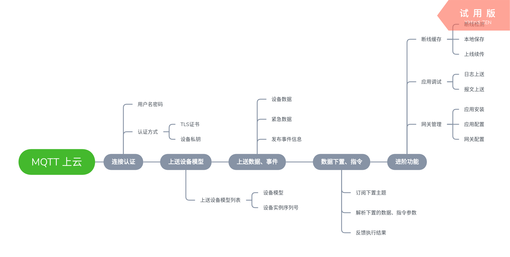

---

# 数据上云

此章将介绍如何开发一个数据上云的应用。您将学习到如何使用 MQTT 协议将 FreeIOE 内的设备数据送到云平台。

## 什么是 MQTT 协议

MQTT 是物联网云平台常见的一种对接协议，更多内容可以访问 [MQTT 协议简介](https://wiki.freeioe.org/doku.php?id=mqtt:start)



## 构造 MQTT 上云应用

FreeIOE 提供了 MQTT 上云类应用的基础模块，本章将基于此模块来构建应用。 [手册](../../../reference/app/base/mqtt.md)

```lua
local mqtt_base = require 'app.base.mqtt'

local app = mqtt_base:subclass('EXAMPLE_MQTT_APP_IN_GUIDE')
app.static.API_VER = 5
```

## 连接认证

为了简化例程，我们使用了匿名的、非安全的连接方式。需要设定连接参数：
* 服务器地址
* 服务器端口(1883)

``` lua
function app:on_init()
	local conf = self._conf
	conf.server = "192.168.1.100" --- MQTT 服务器地址
	conf.port = 1883 -- MQTT端口
end
```

## 上送设备模型

上送数据模型时，我们需要实现下面的函数:

``` lua
function app:on_publish_devices(devices)
	--- convert devices to json string
	local data, err = cjson.encode(devices)
	if not data then
		return nil, err
	end
	return self:publish(self._mqtt_id.."/devices", data, 1, true)
end
```

devices 参数是一个 Lua 的 Table 数据，是以设备序列号为 KEY， 设备模型为 VALUE 的 Table 数据。

## 上送设备数据、事件

### 设备数据

通过实现下属函数，就能接收其他应用发布的设备数据，并通过 publish 方式发布数据到云平台。

```lua
--- 单个数据上送
function app:on_publish_data(key, value, timestamp, quality)
	local msg = {{key, value, timestamp, quality}}
	return self:publish(self._mqtt_id.."/data", cjson.encode(msg), 0, false)
end

--- 打包上送
function app:on_publish_data_list(val_list)
    local data = cjson.encode(val_list)
	return self:publish(self._mqtt_id.."/data", data, 0, false)
end
```

参数说明:
1. key
   数据关键字信息，默认为 <device_sn>/<input_name>/<input_prop_name>，如需要更改，请实现```app:pack_key(app_src, device_sn, input, prop)``` 函数
2. value
   数据值，类型请参考对应的模型信息中的 vt 字段
3. timestamp
   时间戳，如： 1575370087.13
4. quality
   质量戳，如： 0

> 关于数据的打包上送的参数调整，请参考[接口手册](../../../reference/app/base/mqtt.md)

### 设备紧急数据

这里我们使用了跟普通数据同一个主题来发布紧急数据。

```lua
function app:on_publish_data_em(key, value, timestamp, quality)
	return self:on_publish_data(key, value, timestamp, quality)
end
```

### 上送事件

应用、设备会产生事件时，我们可以通过实现 ```on_event``` 函数来将我们需要的事件信息，上送到云平台。

```lua

function app:on_event(app, sn, level, type_, info, data, timestamp)
	local event = {
		level = level,
		['type'] = tyep_,
		info = info,
		data = data,
		app = app
	}
	local msg = {sn, event, timestamp}
	return self:publish(self._mqtt_id.."/event", cjson.encode(msg), 1, false)
end
```

## 数据下置、设备指令

云平台若是需要下置数据到设备、请求设备执行某条指令，则需要根据平台的标准，去订阅接收数据和指令的主题。然后通过 ```device:set_output_prop``` 和 ```device:send_command```来发起请求。

```lua

--- 下置数据

	local device, err = self._api:get_device(data.device)
	if not device then
		return self:on_mqtt_result(id, false, err or 'Device missing!')
	end

	local priv = {id = id, data = data}
	local r, err = device:set_output_prop(data.output, data.prop or 'value', data.value, ioe.time(), priv)


--- 发起设备指令请求
	local device, err = self._api:get_device(data.device)
	if not device then
		return self:on_mqtt_result(id, false, err or 'Device missing!')
	end

	local priv = {id = id, data = data}
	local r, err = device:send_command(data.cmd, data.param or {}, priv)
```

在 FreeIOE 的其他应用执行数据下置、设备指令并反馈结果后，下列函数将被调用

```lua
--- 数据下置结果反馈
function app:on_output_result(app_src, priv, result, err)
	if not result then
		self._log:error('Set output prop failed!', err)
		return self:on_mqtt_result(priv.id, false, err or 'Set output prop failed')
	else
		return self:on_mqtt_result(priv.id, true, 'Set output prop done!!')
	end
end

--- 设备指令执行结果反馈
function app:on_command_result(app_src, priv, result, err)
	if not result then
		self._log:error('Device command execute failed!', err)
		return self:on_mqtt_result(priv.id, false, err or 'Device command execute failed!')
	else
		return self:on_mqtt_result(priv.id, true, 'Device command execute done!!')
	end
end
```

## 进阶阅读

### Payload 压缩

FreeIOE 有提供数据压缩功能，此功能使用标准的 ZIP 算法来进行。

* [压缩](../../../reference/app/base/mqtt.md#compress)
* [解压](../../../reference/app/base/mqtt.md#uncompress)

### 断线缓存

在工业物联网系统中，为了保证数据的完整性和连续性，FreeIOE 提供了断线缓存的功能：

1. 利用 MQTT QOS 机制来确保数据送达平台
2. 当检测到 MQTT 连接失败时，将未被送达平台的数据进行本地的存储
3. 当检测到 MQTT 连接恢复时，将缓存的数据依次推送至平台

> 注意：FreeIOE 提供的缓存数据上送是跟实时数据同时进行的。

### 应用调试

FreeIOE 在应用调试方面也提供了相关的接口，能让上云应用：

1. 上送 FreeIOE 以及 FreeIOE 应用日志
2. 上送应用发布的设备通讯报文

### 网关管理

FreeIOE 是一个开放的平台，应用可以参与到网关管理：

1. FreeIOE 配置
   1. 系统配置
   2. 云平台连接配置
2. FreeIOE 应用配置
   1. 应用配置信息

### 加密模块
  * [MD5手册](https://github.com/keplerproject/md5)
  * [Hashing手册](https://github.com/user-none/lua-hashings)

## 示例代码

```lua
local cjson = require 'cjson.safe'
local mqtt_app = require 'app.base.mqtt'
local ioe = require 'ioe'

--- 注册对象(请尽量使用唯一的标识字符串)
local app = mqtt_app:subclass("MQTT_EXAMPLE_APP_IN_GUIDE")
--- 设定应用最小运行接口版本(目前版本为1,为了以后的接口兼容性)
app.static.API_VER = 5

function app:on_init()
	local conf = self._conf
	conf.server = "192.168.1.100"
	conf.port = 1883

	self._mqtt_id = self._sys:id()
end

function app:on_publish_devices(devices)
	local new_devices = {}
	for k, v in pairs(self._enable_devices) do
		if v then
			new_devices[k] = devices[k]
		end
	end

	local data, err = cjson.encode(new_devices)
	if not data then
		self._log:error("Devices data json encode failed", err)
		return false
	end

	return self:publish(self._mqtt_id.."/devices", data, 1, true)
end

function app:on_publish_data(key, value, timestamp, quality)
	--local sn, input, prop = string.match(key, '^([^/]+)/([^/]+)/(.+)$')
	local msg = {{ key, value, timestamp, quality}}
	return self:publish(self._mqtt_id.."/data", cjson.encode(msg), 0, false)
end

function app:on_publish_data_em(key, value, timestamp, quality)
	return self:on_publish_data(key, value, timestamp, quality)
end

function app:on_publish_data_list(val_list)
    local data=cjson.encode(val_list)
	return self:publish(self._mqtt_id.."/data", data, 0, false)
end

function app:on_event(app, sn, level, type_, info, data, timestamp)
	local event = {
		level = level,
		['type'] = type_,
		info = info,
		data = data,
		app = app
	}
	return self:publish(self._mqtt_id.."/event", cjson.encode({sn, event, timestamp} ), 1, false)
end

function app:on_mqtt_connect_ok()
	--- subscribe output/command
	self:subscribe(self._mqtt_id..'/output/#', 1)
	self:subscribe(self._mqtt_id..'/command/#', 1)
	--- send online status
	return self:publish(self._mqtt_id.."/status", "ONLINE", 1, true)
end

function app:mqtt_will()
	return self._mqtt_id.."/status", "OFFLINE", 1, true
end

function app:on_mqtt_message(mid, topic, payload, qos, retained)
	local id, t, sub = topic:match('^([^/]+)/([^/]+)(.-)$')
	if id ~= self._mqtt_id and id ~= "ALL" then
		self._log:error("MQTT recevied incorrect topic message")
		return
	end
	local data, err = cjson.decode(payload)
	if not data then
		self._log:error("Decode JSON data failed", err)
		return
	end

	if t == 'output' then
		self:on_mqtt_output(string.sub(sub or '/', 2), data.id, data.data)
	elseif t == 'command' then
		self:on_mqtt_command(string.sub(sub or '/', 2), data.id, data.data)
	else
		self._log:error("MQTT recevied incorrect topic", t, sub)
	end
end

function app:on_mqtt_result(id, result, message)
	local data = {
		id = id,
		result = result,
		message = message,
		timestamp = ioe.time(),
		timestamp_str = os.date()
	}
	self:publish(self._mqtt_id..'/result/output', cjson.encode(data), 0, false)
end

function app:on_mqtt_output(topic, id, data)
	local device, err = self._api:get_device(data.device)
	if not device then
		return self:on_mqtt_result(id, false, err or 'Device missing!')
	end

	local priv = {id = id, data = data}
	local r, err = device:set_output_prop(data.output, data.prop or 'value', data.value, ioe.time(), priv)
	if not r then
		self._log:error('Set output prop failed!', err)
		return self:on_mqtt_result(id, false, err or 'Set output prop failed')
	end
end

function app:on_output_result(app_src, priv, result, err)
	if not result then
		self._log:error('Set output prop failed!', err)
		return self:on_mqtt_result(priv.id, false, err or 'Set output prop failed')
	else
		return self:on_mqtt_result(priv.id, true, 'Set output prop done!!')
	end
end

function app:on_mqtt_command(topic, id, data)
	local device, err = self._api:get_device(data.device)
	if not device then
		return self:on_mqtt_result(id, false, err or 'Device missing!')
	end

	local priv = {id = id, data = data}
	local r, err = device:send_command(data.cmd, data.param or {}, priv)
	if not r then
		self._log:error('Device command execute failed!', err)
		return self:on_mqtt_result(id, false, err or 'Device command execute failed!')
	end
end

function app:on_command_result(app_src, priv, result, err)
	if not result then
		self._log:error('Device command execute failed!', err)
		return self:on_mqtt_result(priv.id, false, err or 'Device command execute failed!')
	else
		return self:on_mqtt_result(priv.id, true, 'Device command execute done!!')
	end
end

--- 返回应用对象
return app
```
