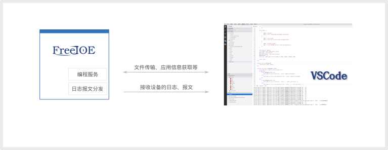

---

# 使用 VS Code 开发应用

VS Code 是微软开发提供的一款非常灵活的编辑器软件。 我们提供了 VS Code的插件，让开发者可以方便快速的进行 FreeIOE 应用开发和调试。

## VS Code 下载

可以从微软网站下载VS Code。[地址](https://code.visualstudio.com/)

## 应用开发插件

运行VS Code，打开插件列表选项页，搜索并安装"IOT Editor"插件。

> 另：建议安装Lua语言插件: LuaCoderAssist

### 插件功能列表

* 连接 FreeIOE 网关设备
* 自动映射设备的应用源码，同步修改设备中的应用源码
* 启动、停止 FreeIOE 应用
* 显示 FreeIOE 应用的配置信息
* 显示输出来自网关设备的日志、报文
* 显示网关设备的事件列表

### IOT Editor 界面功能区

#### 资源管理器

连接上的设备中的应用列表，会被映射到资源管理器中。资源管理会出现一个设备名称同名的文件夹，下面就是该设备的应用列表

#### FreeIOE Devices 窗口

此窗口显示本地配置的要连接的设备，并在连接成功后显示设备中的应用实例列表，以及应用当前的运行状态

#### Events 窗口

此窗口显示设备内的事件列表。此列表是 FreeIOE 内部缓存的列表，如设备事件过多，则只保留了最新的一些事件信息。

#### 文件编辑区

在资源管理器选择要编辑的应用的代码文件，该文件会被 VS Code 打开并出现在文件编辑区。在文件打开编辑后保存时，IOT Editor 插件会将文件内容同步到网关内。

#### 输出窗口

* IOT EDITOR
  显示插件的一些输出内容，为方便查找 IOT Editor 插件问题
* IOT 设备报文
  显示连接中的设备的通讯报文
* IOT 设备日志
  显示连接中的设备的日志信息

## IOT Editor 插件使用

### 连接设备

操作步骤如下：

1. 在本地磁盘中创建一个新的文件夹
2. 使用 VS Code 打开新建的文件夹
3. 从文件(F)菜单中选择"将工作区另存为"，保存当前工作区文件
4. Shift + Alt + P 搜索运行 "IOT: Setup editor workspace"
5. 在自动打开的 freeioe_devices.json 的 devices 节点下选择一个节点，如Device1节点
6. 将其中的 "host" 修改为真实的设备IP
7. Shift + Alt + P 搜索运行 "IOT: Connect to freeioe device"
8. 选择刚才修改的节点名称，如
9. 当设备连接成功后，在资源管理器的工作区下，会出现以设备名为名称的目录节点（该节点映射了设备中的应用列表）

注意：

> 一般情况下，请勿修改设备端口(port)，默认情况下设备的编程端口为8818
> 如FreeIOE的管理密码被修改，请对应修改password为正确的密码

### 新建应用

使用 IOT Editor 可以创建一个全新的应用，步骤如下

1. Shift + Alt + P 搜索运行 "IOT: Create new application"
2. 输入应用实例名称
3. 输入应用名称
4. VS Code 资源窗口，在当前设备目录下会出现新建的应用。
5. 打开应用下面的入口文件 app.lua，即可进行应用开发

### 开发调试

在资源窗口的应用目录名，或者文本编辑区点击右键，会有应用控制菜单：

* 启动应用
* 停止应用
* 重启应用

在编辑好代码、并保存后，可以通过这次菜单，来控制应用。 通过输出窗口的日志、报文等信息来观察应用的运行情况。 如需要观察数据，请打开冬笋云的数据浏览页面。

### 下载并发布

当应用代码开发调试完毕，通过 "Download Application" 右键菜单下载应用包:

1. 文件浏览器窗口的应用目录点击右键
2. 设备列表窗口的应用节点点击右键

IOT Editor会从设备中下载打包好的应用包到指定的目录。 下载的应用包，即可直接在应用中心上传和发布此应用。

> 建议手工修改version文件，确保版本和应用中心上传时的版本一致。
